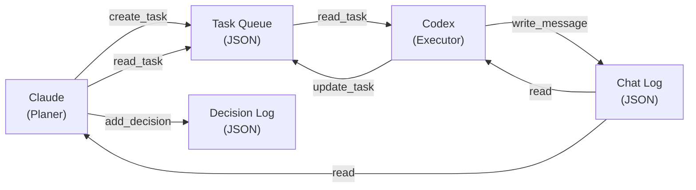
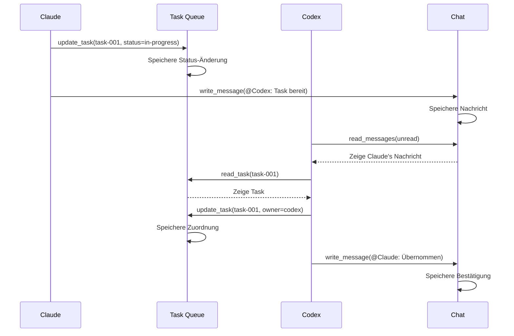
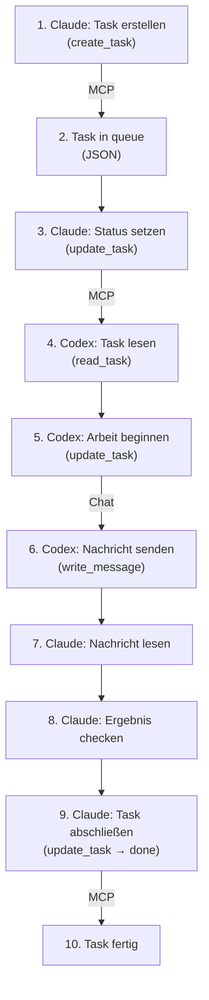

# Claude-Codex-MCP: Getting Started Guide

**Zielgruppe:** Anfänger, die Claude-Codex-MCP zum ersten Mal einrichten und nutzen

**Lernziel:** Nach diesem Guide hast du Claude-Codex-MCP installiert, ein Projekt erstellt und deine erste Task zwischen Claude und Codex übergeben.

---

## 1. Was ist Claude-Codex-MCP?

Claude-Codex-MCP ist eine gemeinsame Workbench für Claude und Codex — zwei KI-Agenten, die zusammenarbeiten, um komplexe Aufgaben zu lösen. 

**Die Kernidee:**
- **Claude** (das stärkere Modell) plant Aufgaben, delegiert und prüft Ergebnisse
- **Codex** (der Spezialist) führt Aufgaben aus, schreibt Code, testet
- **Task-Queue** verbindet beide: Tasks werden erstellt, zugewiesen, aktualisiert, abgeschlossen
- **Chat-System** ermöglicht Kommunikation zwischen den Agenten
- **Entscheidungs-Log** dokumentiert wichtige "Why"-Entscheidungen

**Warum das gut ist:**
- Teuer-Ressourcen (Claude) für Denken und Prüfen reservieren
- Günstige Ressourcen (Codex) für Routine-Arbeit nutzen
- Transparente Kommunikation zwischen Agenten
- Lokale Speicherung: deine Daten bleiben bei dir
- Keine externen APIs für die Agenten-Kommunikation nötig

**Architektur (vereinfacht):**



---

## 2. Schritt 1: Installation

Claude-Codex-MCP läuft auf deinem Computer — keine Cloud-Abhängigkeit.

### 2.1 Voraussetzungen

- **macOS:** Xcode Command Line Tools (`xcode-select --install`)
- **Linux:** Build-Tools (`apt-get install build-essential`, `sudo yum groupinstall "Development Tools"`)
- **Windows:** Windows Subsystem for Linux (WSL) oder Git Bash
- **Alle:** Git und Node.js 18+ (`node --version`)

### 2.2 Installation unter macOS

**Download & Installation:**
```bash
# Option 1: Über Homebrew (wenn verfügbar)
brew install claude-codex-mcp

# Option 2: DMG-Download
# Besuche https://github.com/anthropic/claude-codex-mcp/releases
# Lade die neueste .dmg-Datei herunter
# Doppelklick → folge dem Installer
```

**Verifizierung:**
```bash
claude-codex-mcp --version
# Output: claude-codex-mcp v1.2.3
```

### 2.3 Installation unter Linux/Windows (Node.js)

```bash
# Clone das Repository
git clone https://github.com/anthropic/claude-codex-mcp.git
cd claude-codex-mcp

# Dependencies installieren
npm install

# Global verfügbar machen
npm link

# Verifizierung
claude-codex-mcp --version
```

### 2.4 Erstkonfiguration

```bash
# MCP initialisieren
claude-codex-mcp init

# Interaktive Fragen:
# → Projekt-Name: my-first-project
# → Speicherort: ~/projects/my-first-project
# → Agenten-Name (Claude): claude
# → Agenten-Name (Codex): codex
# → MCP-Port: 8765 (default)

# Output:
# ✓ Projekt initialisiert unter ~/projects/my-first-project
# ✓ MCP läuft auf http://localhost:8765
```

> **Tipp:** MCP läuft immer im Hintergrund. Beim Neustart des Computers startet der Daemon automatisch (bei Installation via Homebrew).

---

## 3. Schritt 2: Erstes Projekt erstellen

Lass uns die Struktur eines Claude-Codex-MCP-Projekts verstehen.

### 3.1 Projektstruktur

Nach `claude-codex-mcp init` sieht dein Projektordner so aus:

```
my-first-project/
├── .claude/
│   ├── mcp.json           # MCP-Konfiguration
│   └── claude.json        # Claude-spezifische Settings
├── .codex/
│   ├── mcp.json           # Codex-Konfiguration
│   └── codex.json         # Codex-spezifische Settings
├── tasks/
│   └── .gitkeep
├── chat/
│   └── .gitkeep
├── decisions/
│   └── .gitkeep
├── README.md              # Projekt-Dokumentation
└── .gitignore             # Git-Ignore-Regeln
```

**Was jeder Ordner macht:**

| Ordner | Inhalt | Wer nutzt es |
|--------|--------|-------------|
| `.claude/` | Claude-Konfiguration & MCP-URL | Claude Agent |
| `.codex/` | Codex-Konfiguration & MCP-URL | Codex Agent |
| `tasks/` | JSON-Dateien für jede Task | Beide |
| `chat/` | Chat-Nachrichten zwischen Agenten | Beide |
| `decisions/` | Entscheidungs-Log (Why-Dokumentation) | Beide |

### 3.2 Projekt manuell erstellen

Falls du nicht `init` nutzen möchtest, erstelle die Struktur manuell:

```bash
# Ordner erstellen
mkdir -p my-project/{tasks,chat,decisions,.claude,.codex}

# README schreiben
cat > my-project/README.md << 'EOF'
# Mein erstes Claude-Codex-MCP Projekt

## Beschreibung
Dieses Projekt testet die Zusammenarbeit zwischen Claude und Codex.

## Tasks
- [x] Projekt-Setup
- [ ] Dokumentation schreiben
- [ ] Erste Task durchführen

## Agenten
- **Claude:** Planer & Prüfer
- **Codex:** Executor

## Status
🟢 In Vorbereitung
EOF

# .gitignore erstellen
cat > my-project/.gitignore << 'EOF'
node_modules/
.DS_Store
*.log
.env.local
EOF

# Git initialisieren (optional)
cd my-project
git init
```

> **Tipp:** Nutze `claude-codex-mcp init` für Erstkonfigurationen — die CLI setzt alle Dateien korrekt auf.

---

## 4. Schritt 3: Erste Task hinzufügen

Tasks sind die Arbeitspakete, die Claude und Codex verwalten. Jede Task ist eine JSON-Datei mit Status, Beschreibung, Assignee, etc.

### 4.1 Task-Format verstehen

```json
{
  "id": "task-001",
  "title": "Dokumentation schreiben",
  "description": "Schreibe eine README für das Projekt mit Übersicht und Setup-Guide",
  "status": "open",
  "owner": null,
  "created_by": "claude",
  "created_at": "2025-07-22T10:00:00Z",
  "updated_at": "2025-07-22T10:00:00Z",
  "blockers": [],
  "priority": "high",
  "estimated_hours": 2
}
```

**Feld-Erklärung:**

| Feld | Typ | Beschreibung |
|------|-----|-------------|
| `id` | string | Eindeutige ID (z.B. `task-001`) |
| `title` | string | Kurztitel (max 80 Zeichen) |
| `description` | string | Ausführliche Beschreibung & Akzeptanzkriterien |
| `status` | enum | `open` \| `in-progress` \| `blocked` \| `done` |
| `owner` | string \| null | `claude` \| `codex` \| `null` (unzugewiesen) |
| `created_by` | string | Wer hat die Task erstellt? |
| `created_at` | ISO-8601 | Erstellungs-Zeitstempel |
| `updated_at` | ISO-8601 | Zuletzt aktualisiert |
| `blockers` | array | IDs von Tasks, die diese blockieren |
| `priority` | enum | `low` \| `medium` \| `high` \| `critical` |
| `estimated_hours` | number | Geschätzte Arbeitsstunden |

### 4.2 Task erstellen

**Option A: Via CLI**

```bash
cd my-project

claude-codex-mcp task create \
  --title "Dokumentation schreiben" \
  --description "Schreibe eine README für das Projekt mit Übersicht, Setup und Best Practices" \
  --priority high \
  --estimated-hours 3
```

**Option B: Manuell (JSON-Datei)**

Erstelle `tasks/task-001-dokumentation.json`:

```json
{
  "id": "task-001",
  "title": "Dokumentation schreiben",
  "description": "Schreibe eine README für das Projekt mit:\n- Übersicht (Was ist Claude-Codex-MCP?)\n- Setup-Guide (Installation)\n- Quick-Start (erste Task)\n\nAkzeptanzkriterien:\n✓ README existiert in Markdown\n✓ Mindestens 500 Wörter\n✓ Code-Beispiele vorhanden\n✓ Kein Spelling/Grammar Errors",
  "status": "open",
  "owner": null,
  "created_by": "admin",
  "created_at": "2025-07-22T10:00:00Z",
  "updated_at": "2025-07-22T10:00:00Z",
  "blockers": [],
  "priority": "high",
  "estimated_hours": 3
}
```

### 4.3 Task-Liste ansehen

```bash
# Alle Tasks auflisten
claude-codex-mcp task list

# Output:
# ID         | Title                    | Status      | Owner  | Priority
# task-001   | Dokumentation schreiben  | open        | --     | high
# task-002   | Tests schreiben          | open        | --     | medium
```

---

## 5. Schritt 4: Claude integrieren

Damit Claude deine Tasks sieht und aktualisieren kann, verbindest du Claude mit der MCP.

### 5.1 MCP-Konfiguration für Claude

Öffne oder erstelle `~/.claude/claude_desktop_config.json` (oder `.claude/claude.json` im Projekt):

```json
{
  "mcpServers": {
    "claude-codex-mcp": {
      "command": "claude-codex-mcp",
      "args": [
        "mcp",
        "--project-path",
        "/Users/deinname/projects/my-first-project"
      ],
      "env": {
        "CLAUDE_CODEX_MCP_PORT": "8765"
      }
    }
  }
}
```

**Wichtige Felder:**
- `command`: MCP-Kommando (installiert via `npm link`)
- `--project-path`: Pfad zu deinem Projekt (absoluter Pfad!)
- `CLAUDE_CODEX_MCP_PORT`: Port, auf dem MCP läuft (default: 8765)

### 5.2 Claude starten & verifizieren

```bash
# Claude starten (mit aktivem MCP)
claude

# Im Claude-Chat:
# "Kannst du mir die offenen Tasks anzeigen?"
```

**Erwartete Antwort von Claude:**
```
Ich rufe die offenen Tasks ab...

[Claude nutzt das MCP Tool "read_tasks"]

Es gibt 1 offene Task:
- task-001: Dokumentation schreiben (Priorität: high, geschätzte Stunden: 3)
```

> **Fehler?** Siehe Troubleshooting-Sektion [5.2.1]

### 5.2.1 Troubleshooting: Claude sieht keine Tasks

| Fehler | Lösung |
|--------|--------|
| `MCP connection refused` | MCP läuft nicht. Führe `claude-codex-mcp mcp --project-path /pfad/zum/projekt` aus. |
| `Project path not found` | Pfad in `claude_desktop_config.json` ist falsch. Nutze `pwd` um den absoluten Pfad zu checken. |
| `No tasks found` | Tasks-Ordner ist leer. Erstelle eine Task mit `claude-codex-mcp task create ...` |
| `Permission denied` | Ordner-Berechtigungen prüfen: `chmod -R u+rwx tasks/ chat/ decisions/` |

---

## 6. Schritt 5: Erste Task-Übergabe

Jetzt nutzen wir Claude und Codex zusammen!

### 6.1 Claude aktualisiert Task-Status

Im Claude-Chat:

```
Bitte aktualisiere task-001 auf "in-progress" und setze mich (Claude) als Owner.
```

**Hinter den Kulissen:**
1. Claude ruft das Tool `update_task` auf
2. MCP aktualisiert `task-001.json`:
   - `status` → `in-progress`
   - `owner` → `claude`
   - `updated_at` → jetzt
3. Task-Datei wird auf der Festplatte gespeichert

**Task-Datei danach:**
```json
{
  "id": "task-001",
  "title": "Dokumentation schreiben",
  "status": "in-progress",
  "owner": "claude",
  "updated_at": "2025-07-22T10:15:00Z",
  ...
}
```

### 6.2 Claude schreibt eine Chat-Nachricht

```
Schreibe eine Nachricht an Codex und übertrag die Task an ihn.
```

Claude schreibt:
```
@Codex: Ich bin fertig mit der Planung. Die Task "Dokumentation schreiben" liegt für dich bereit. 
Bitte übernimm und aktualisiere den Status auf "in-progress".
```

**Chat-Datei:** `chat/message-001.json`
```json
{
  "id": "message-001",
  "author": "claude",
  "recipient": "codex",
  "timestamp": "2025-07-22T10:20:00Z",
  "content": "@Codex: Ich bin fertig mit der Planung. Die Task 'Dokumentation schreiben' liegt für dich bereit...",
  "mentions": ["codex"],
  "task_ids": ["task-001"]
}
```

### 6.3 Codex sieht die Nachricht & übernimmt

Codex liest:
1. Neue Chat-Nachricht von Claude
2. Liest Task `task-001`
3. Aktualisiert Task: `owner` → `codex`, `status` → `in-progress`
4. Schreibt Bestätigung: `@Claude: Habe die Task übernommen. Starte Arbeit.`

**Visualisiert:**



---

## 7. Was ist passiert? Der große Überblick

Lass uns zusammenfassen, was du bisher gelernt hast:

### 7.1 Die Komponenten

```
┌─────────────────────────────────────────────────────────┐
│           Claude-Codex-MCP Projekt                       │
├─────────────────────────────────────────────────────────┤
│  Tasks/         Chat/         Decisions/                │
│  ├─ task-001    ├─ msg-001    ├─ dec-001               │
│  ├─ task-002    ├─ msg-002    └─ dec-002               │
│  └─ ...         └─ ...                                 │
│                                                         │
│  MCP Server (läuft lokal)                              │
│  ├─ Tools: read_task, update_task, write_message...   │
│  └─ Auth: Lokal, keine externe Abhängigkeit           │
│                                                         │
│  Claude Agent          Codex Agent                      │
│  ├─ Planner            ├─ Executor                      │
│  ├─ Reviewer           ├─ Developer                     │
│  └─ Connected via MCP  └─ Connected via MCP            │
└─────────────────────────────────────────────────────────┘
```

### 7.2 Wer kann was machen?

| Agent | Kann lesen | Kann schreiben | Zweck |
|-------|-----------|----------------|-------|
| **Claude** | Tasks, Chat, Decisions | Tasks (status), Chat, Decisions | Plant, delegiert, prüft |
| **Codex** | Tasks, Chat | Tasks (status, owner), Chat | Führt aus, implementiert |
| **Admin** | Alles | Alles | Setup, Verwaltung |

### 7.3 Typischer Workflow



---

## 8. Nächste Schritte

Du hast die Basics geschafft! Hier sind Schritte zum Vertiefen:

### 8.1 Mehrere Tasks verwalten

```bash
# Task 2 erstellen
claude-codex-mcp task create \
  --title "Tests schreiben" \
  --description "Unit Tests für alle Module" \
  --priority medium

# Task 3 erstellen
claude-codex-mcp task create \
  --title "Deployment vorbereiten" \
  --description "Docker-Setup, CI/CD Pipeline" \
  --priority high
```

**Im Claude-Chat:**
```
Zeige mir alle offenen Tasks sortiert nach Priorität.
Welche sollten wir zuerst machen?
```

### 8.2 Blocker setzen (Task-Abhängigkeiten)

Wenn Task B von Task A abhängig ist:

```bash
# Task 2 erstellen und Blocker setzen
claude-codex-mcp task create \
  --title "Dokumentation deployen" \
  --description "Veröffentliche README auf GitHub" \
  --blockers "task-001"  # Hängt von task-001 ab
```

**Workflow damit:**
1. Task-001 (Dokumentation schreiben) muss erst fertig sein
2. Solange ist Task-002 "blocked" (nicht startbar)
3. Sobald Task-001 → "done", wird Task-002 → "open" (startbar)

### 8.3 Entscheidungen dokumentieren

Wichtige Design-Entscheidungen sollten geloggt werden:

```bash
# Im Claude-Chat:
# "Dokumentiere die Entscheidung: Warum nutzen wir Node.js und nicht Python?"
```

**Das erzeugt:** `decisions/decision-001.json`
```json
{
  "id": "decision-001",
  "title": "Backend: Node.js statt Python",
  "why": "Konsistenz mit Frontend (JavaScript), bessere Performance für I/O",
  "what": "Wir schreiben den Backend in Node.js mit Express",
  "how": "npm init, dependencies in package.json, Docker für Deployment",
  "decided_by": "claude",
  "decided_at": "2025-07-22T11:00:00Z",
  "impact": "Alle Backend-Entwickler nutzen Node.js & npm"
}
```

> Diese Entscheidungen helfen Codex zu verstehen, **warum** etwas so gemacht wurde.

### 8.4 Best Practices lernen

Lese die [Best Practices Guide](12-Best-Practices.md):
- Wie man gute Tasks schreibt
- Task-Abhängigkeiten richtig nutzen
- Chat effektiv einsetzen
- Performance optimieren

### 8.5 Erweiterte Features

- **Custom MCP Tools:** Eigene Tools schreiben (Python/Node.js)
- **Webhooks:** Task-Updates triggern externe Systeme
- **Export/Import:** Tasks in andere Systeme übertragen
- **Multi-Agent Setup:** Mehr als 2 Agenten koordinieren

---

## 9. Häufige Fehler & Lösungen

### 9.1 "MCP connection refused"

**Problem:** Claude/Codex können sich nicht mit MCP verbinden.

**Lösung:**
```bash
# 1. MCP manuell starten
claude-codex-mcp mcp --project-path /path/to/project

# 2. In anderem Terminal: Claude starten
claude

# 3. Im Chat testen:
# "Zeige mir die Tasks"
```

### 9.2 "Task not found"

**Problem:** MCP sagt, Task existiert nicht.

**Lösung:**
```bash
# 1. Task-Datei existiert?
ls -la tasks/

# 2. Korrekte Task-ID?
claude-codex-mcp task list

# 3. Falsche JSON-Syntax? Validiere:
cat tasks/task-001.json | python3 -m json.tool
```

### 9.3 "Permission denied"

**Problem:** Agenten können Task-Dateien nicht schreiben.

**Lösung:**
```bash
# Permissions korrigieren
chmod -R u+rwx tasks/ chat/ decisions/

# Oder: Projekt von Scratch starten
rm -rf .claude .codex
claude-codex-mcp init
```

### 9.4 "No unread messages"

**Problem:** Codex sieht Chat-Nachrichten nicht.

**Lösung:**
```bash
# 1. Chat-Datei existiert?
ls -la chat/

# 2. Nachricht hat korrekte JSON-Struktur?
cat chat/message-001.json | python3 -m json.tool

# 3. Recipient-Feld korrekt?
grep "recipient" chat/*.json
```

---

## 10. Zusammenfassung: Dein erstes Projekt

Du hast gerade:

✅ Claude-Codex-MCP installiert  
✅ Ein Projekt erstellt (Ordner-Struktur)  
✅ Eine Task hinzugefügt (JSON-Format)  
✅ Claude konfiguriert (claude_desktop_config.json)  
✅ Claude & Codex eine Task übergeben lassen (MCP-Integration)  
✅ Chat-Nachrichten zwischen Agenten ausgetauscht  

**Nächst:** Lies die [Claude Integration Guide](11-Claude-Integration-Beispiel.md) für tieferes Verständnis.

---

## 11. Ressourcen

| Resource | Link | Inhalt |
|----------|------|--------|
| GitHub Repo | [github.com/anthropic/claude-codex-mcp](https://github.com/anthropic/claude-codex-mcp) | Source Code, Issues |
| Docs | [claude-codex-mcp.readthedocs.io](https://claude-codex-mcp.readthedocs.io) | Vollständige Dokumentation |
| Examples | `./examples/` im Repo | Arbeitsbeispiele |
| Discord | [discord.gg/anthropic](https://discord.gg/anthropic) | Community-Support |

---

**Seite verfasst:** 2025-07-22  
**Version:** 1.0  
**Status:** ✅ Für Anfänger fertig
