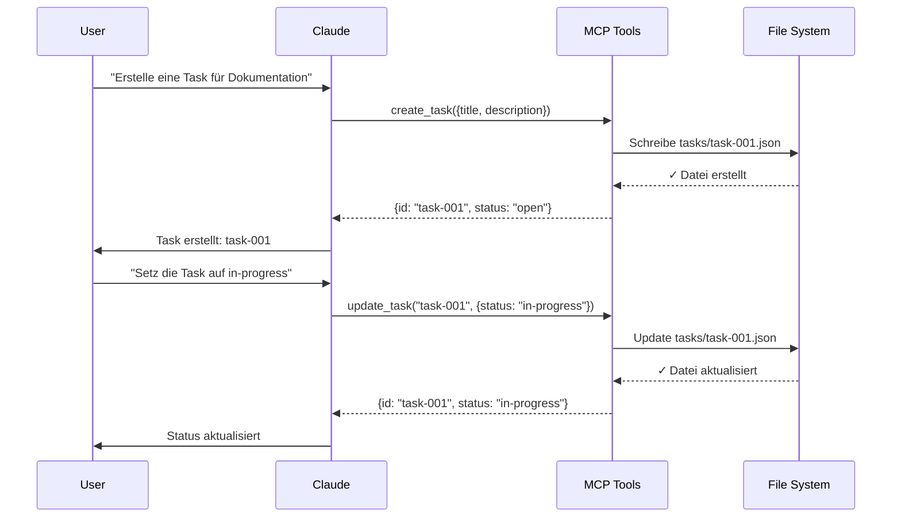
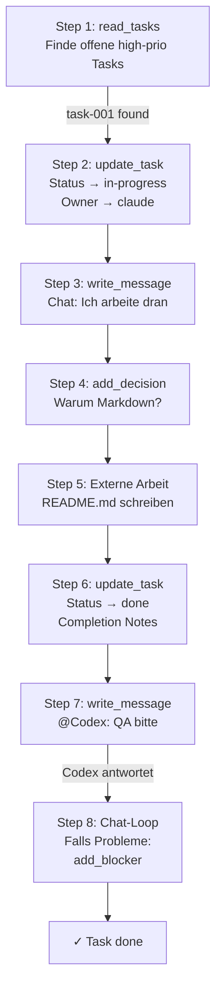

# Claude-Integration: Praktische Beispiele & Deep Dive

**Zielgruppe:** Entwickler, die Claude mit Claude-Codex-MCP konfigurieren und erweiterte Features nutzen

**Lernziel:** Du verstehst jedes MCP-Tool, kannst es aufrufen und nutzt es in realen Szenarien.

---

## 1. Überblick: Was Claude mit MCP machen kann

Claude ist in einer Claude-Codex-MCP-Umgebung nicht einfach ein Chatbot — Claude wird ein **Agent**, der mit der Task-Queue interagiert.

### 1.1 Verfügbare Tools für Claude

| Tool | Zweck | Rückgabe | Beispiel |
|------|-------|----------|----------|
| `read_tasks` | Tasks lesen (mit Filter) | Array von Task-Objekten | Alle "open" Tasks |
| `create_task` | Neue Task erstellen | Task-ID | `task-002` |
| `update_task` | Task ändern (status, owner, etc.) | Updated Task-Objekt | Status → "done" |
| `add_blocker` | Task-Abhängigkeit setzen | Blocker-ID | task-001 blockiert task-002 |
| `resolve_blocker` | Abhängigkeit löschen | Boolean (erfolgreich) | task-001 fertig, task-002 freigeben |
| `write_message` | Chat-Nachricht schreiben | Message-ID | Nachricht an Codex |
| `add_decision` | Entscheidung dokumentieren | Decision-ID | "Why"-Dokumentation |
| `append_chat` | Nachricht an lokales Log | Boolean | Task-Ergebnis loggen |

### 1.2 Ablauf einer Claude-Task



---

## 2. Setup: MCP in Claude konfigurieren

Damit Claude die MCP-Tools nutzen kann, musst du den MCP-Server in Claude registrieren.

### 2.1 Konfigurationsdatei: claude_desktop_config.json

**Speicherort:**
- macOS: `~/.claude/claude_desktop_config.json`
- Linux: `~/.config/claude/claude_desktop_config.json`
- Windows: `%APPDATA%\Claude\claude_desktop_config.json`

**Vollständiges Beispiel:**

```json
{
  "mcpServers": {
    "claude-codex-mcp-dev": {
      "command": "node",
      "args": [
        "/Users/michaelgahn/projects/claude-codex-mcp/dist/index.js"
      ],
      "env": {
        "PROJECT_PATH": "/Users/michaelgahn/projects/my-first-project",
        "AGENT_NAME": "claude",
        "LOG_LEVEL": "debug"
      }
    }
  }
}
```

**Alternative: Mit installertem CLI**

```json
{
  "mcpServers": {
    "claude-codex-mcp": {
      "command": "claude-codex-mcp",
      "args": [
        "mcp",
        "--project-path",
        "/Users/michaelgahn/projects/my-first-project",
        "--agent",
        "claude"
      ]
    }
  }
}
```

### 2.2 Projekt-spezifische Config: `.claude/claude.json`

Alternativ: Projekt-lokale Konfiguration

```json
{
  "mcp": {
    "enabled": true,
    "server": "http://localhost:8765",
    "project_path": "./",
    "agent_name": "claude"
  },
  "behavior": {
    "auto_update_status": true,
    "write_decisions": true,
    "notify_codex": true
  },
  "rate_limits": {
    "tasks_per_minute": 10,
    "messages_per_minute": 20
  }
}
```

### 2.3 Verify: MCP läuft & Claude sieht es

**Test 1: MCP läuft?**

```bash
# In Terminal 1: MCP starten
claude-codex-mcp mcp --project-path /path/to/project

# Output:
# 2025-07-22T10:00:00Z [info] MCP server starting on port 8765
# 2025-07-22T10:00:00Z [info] Project loaded: /path/to/project
# 2025-07-22T10:00:00Z [info] Ready for connections
```

**Test 2: Claude sieht MCP?**

```bash
# In Terminal 2: Claude starten
claude

# Im Chat:
# "Teste die MCP-Verbindung. Wie viele Tasks sind offen?"
```

**Erwartete Antwort:**
```
Verbindung wird getestet...
[Claude nutzt Tool: read_tasks]
Es gibt 1 offene Task:
- task-001: Dokumentation schreiben
```

---

## 3. Tool 1: Tasks lesen (read_tasks)

Das wichtigste Tool — Claude liest die Task-Queue.

### 3.1 Syntax & Parameter

```json
{
  "tool": "read_tasks",
  "parameters": {
    "filter": {
      "status": "open",
      "owner": "claude",
      "priority": "high"
    },
    "sort_by": "priority",
    "limit": 10
  }
}
```

**Optionale Filter:**

| Filter | Typ | Beispiel | Ergebnis |
|--------|-----|---------|----------|
| `status` | string | `"open"` | Nur Tasks mit status=open |
| `owner` | string | `"codex"` | Tasks zugeordnet zu Codex |
| `priority` | string | `"high"` | Nur high-Priority Tasks |
| `created_by` | string | `"claude"` | Nur von Claude erstellte Tasks |
| `has_blockers` | boolean | `true` | Nur Tasks mit Abhängigkeiten |

### 3.2 Praktische Beispiele

**Beispiel 1: Alle offenen Tasks**

```bash
# Im Claude-Chat:
# "Zeige mir alle Tasks, die noch nicht gemacht sind."
```

**Request (intern):**
```json
{
  "tool": "read_tasks",
  "parameters": {
    "filter": { "status": "open" }
  }
}
```

**Response:**
```json
{
  "success": true,
  "tasks": [
    {
      "id": "task-001",
      "title": "Dokumentation schreiben",
      "status": "open",
      "owner": null,
      "priority": "high"
    },
    {
      "id": "task-002",
      "title": "Tests schreiben",
      "status": "open",
      "owner": null,
      "priority": "medium"
    }
  ],
  "total": 2
}
```

**Beispiel 2: Codex's aktuelle Tasks**

```bash
# Im Claude-Chat:
# "Was arbeitet Codex gerade dran?"
```

**Request:**
```json
{
  "tool": "read_tasks",
  "parameters": {
    "filter": {
      "owner": "codex",
      "status": "in-progress"
    }
  }
}
```

**Response:**
```json
{
  "success": true,
  "tasks": [
    {
      "id": "task-003",
      "title": "Backend API implementieren",
      "status": "in-progress",
      "owner": "codex",
      "estimated_hours": 5,
      "updated_at": "2025-07-22T10:30:00Z"
    }
  ],
  "total": 1
}
```

**Beispiel 3: Kritische blockierte Tasks**

```bash
# Im Claude-Chat:
# "Gibt es irgendwelche kritischen Tasks, die blockiert sind?"
```

**Request:**
```json
{
  "tool": "read_tasks",
  "parameters": {
    "filter": {
      "priority": "critical",
      "status": "blocked"
    }
  }
}
```

### 3.3 Task-Objekt verstehen

Die Rückgabe von `read_tasks` ist eine vollständige Task:

```json
{
  "id": "task-001",
  "title": "Dokumentation schreiben",
  "description": "Schreibe README mit Setup-Guide",
  "status": "open",
  "owner": null,
  "created_by": "claude",
  "created_at": "2025-07-22T10:00:00Z",
  "updated_at": "2025-07-22T10:00:00Z",
  "priority": "high",
  "estimated_hours": 3,
  "blockers": [],
  "blocked_by": ["task-000"],
  "tags": ["documentation", "urgent"],
  "assignee_notes": null,
  "completion_notes": null
}
```

> **Feld-Hinweis:** `blocked_by` vs. `blockers`
> - `blockers`: Diese Task blockiert andere (z.B. [task-002, task-003])
> - `blocked_by`: Diese Task wird blockiert von anderen (z.B. [task-000])

---

## 4. Tool 2: Tasks aktualisieren (update_task)

Claude ändert Task-Eigenschaften.

### 4.1 Syntax & Parameter

```json
{
  "tool": "update_task",
  "parameters": {
    "task_id": "task-001",
    "updates": {
      "status": "in-progress",
      "owner": "claude",
      "priority": "critical",
      "description": "Neue Beschreibung..."
    }
  }
}
```

**Updatable Felder:**

| Feld | Typ | Constraints | Beispiel |
|------|-----|-------------|----------|
| `status` | enum | `open` \| `in-progress` \| `blocked` \| `done` | `"done"` |
| `owner` | string | `"claude"` \| `"codex"` \| `null` | `"codex"` |
| `priority` | enum | `low` \| `medium` \| `high` \| `critical` | `"high"` |
| `description` | string | Max 5000 Chars | `"Neue Desc..."` |
| `estimated_hours` | number | > 0 | `5` |
| `assignee_notes` | string | Notizen von Owner | `"Schwieriger als gedacht"` |

### 4.2 Praktische Beispiele

**Beispiel 1: Task beginnen (Status + Owner)**

```bash
# Im Claude-Chat:
# "Übernimm die task-001 und setze sie auf in-progress"
```

**Request:**
```json
{
  "tool": "update_task",
  "parameters": {
    "task_id": "task-001",
    "updates": {
      "status": "in-progress",
      "owner": "claude"
    }
  }
}
```

**Response:**
```json
{
  "success": true,
  "task": {
    "id": "task-001",
    "status": "in-progress",
    "owner": "claude",
    "updated_at": "2025-07-22T10:15:00Z"
  }
}
```

**Beispiel 2: Task abschließen mit Notizen**

```bash
# Im Claude-Chat:
# "Schließe task-002 ab. Notiz: Alle Tests grün ✓"
```

**Request:**
```json
{
  "tool": "update_task",
  "parameters": {
    "task_id": "task-002",
    "updates": {
      "status": "done",
      "owner": "claude",
      "completion_notes": "Alle Tests grün ✓. README auf Rechtschreibung geprüft."
    }
  }
}
```

**Beispiel 3: Priorität erhöhen**

```bash
# Im Claude-Chat:
# "Erhöhe die Priorität von task-004 auf critical — wir brauchen das sofort."
```

**Request:**
```json
{
  "tool": "update_task",
  "parameters": {
    "task_id": "task-004",
    "updates": {
      "priority": "critical"
    }
  }
}
```

**Beispiel 4: Task an Codex übergeben**

```bash
# Im Claude-Chat:
# "Übergib task-003 an Codex für die Implementierung"
```

**Request:**
```json
{
  "tool": "update_task",
  "parameters": {
    "task_id": "task-003",
    "updates": {
      "owner": "codex",
      "status": "open",
      "assignee_notes": "Schreibe Unit Tests für alle Module. Achte auf Edge Cases."
    }
  }
}
```

---

## 5. Tool 3: Chat-Nachrichten (write_message)

Claude schreibt Nachrichten an andere Agenten.

### 5.1 Syntax & Parameter

```json
{
  "tool": "write_message",
  "parameters": {
    "recipient": "codex",
    "content": "Hallo Codex, task-001 ist bereit für dich.",
    "mentions": ["codex", "task-001"],
    "priority": "normal"
  }
}
```

**Parameter:**

| Parameter | Typ | Beschreibung |
|-----------|-----|-------------|
| `recipient` | string | `"codex"` \| `"claude"` \| `"all"` |
| `content` | string | Die Nachricht (Markdown möglich) |
| `mentions` | array | Erwähnte Agenten/Tasks (z.B. `["@codex", "task-001"]`) |
| `priority` | enum | `"low"` \| `"normal"` \| `"high"` |
| `task_ids` | array | Verknüpfte Task-IDs |

### 5.2 Praktische Beispiele

**Beispiel 1: Aufgabe übergeben**

```bash
# Im Claude-Chat:
# "Schreibe eine Nachricht an Codex und übergib task-001"
```

**Request:**
```json
{
  "tool": "write_message",
  "parameters": {
    "recipient": "codex",
    "content": "@codex: Ich habe die Anforderungen für task-001 geklärt.\n\n**Task:** Dokumentation schreiben\n**Priorität:** high\n**Geschätzte Stunden:** 3\n\nBitte übernimm die Task und aktualisiere den Status auf in-progress. Danke!",
    "mentions": ["codex"],
    "task_ids": ["task-001"],
    "priority": "high"
  }
}
```

**Chat-Datei (`chat/message-001.json`):**
```json
{
  "id": "message-001",
  "sender": "claude",
  "recipient": "codex",
  "timestamp": "2025-07-22T10:20:00Z",
  "content": "@codex: Ich habe die Anforderungen für task-001 geklärt...",
  "mentions": ["codex"],
  "task_ids": ["task-001"],
  "priority": "high",
  "read_by": []
}
```

**Beispiel 2: Problem melden**

```bash
# Im Claude-Chat:
# "Schreib an Codex: task-003 hat einen Fehler. Bitte debuggen."
```

**Request:**
```json
{
  "tool": "write_message",
  "parameters": {
    "recipient": "codex",
    "content": "@codex: ⚠️ In task-003 gibt es ein Problem:\n\n```\nError: TypeError: Cannot read property 'name' of undefined\nFile: src/backend/user.js line 42\n```\n\nBitte schaue dir das an. Ich setze task-003 auf blocked.",
    "mentions": ["codex"],
    "task_ids": ["task-003"],
    "priority": "high"
  }
}
```

**Beispiel 3: Broadcast-Nachricht**

```bash
# Im Claude-Chat:
# "Teile allen mit: Wir gehen live morgen um 10 Uhr!"
```

**Request:**
```json
{
  "tool": "write_message",
  "parameters": {
    "recipient": "all",
    "content": "🎉 **Wichtige Ankündigung**\n\nWir gehen morgen um 10:00 Uhr live! \n- Alle Tasks müssen bis heute 18:00 fertig sein\n- Letzter QA Check: 19:00\n- Deployment: 09:00 morgen\n\nRanks auf!",
    "priority": "high"
  }
}
```

---

## 6. Tool 4: Entscheidungen dokumentieren (add_decision)

Claude dokumentiert "Why"-Entscheidungen für Zukunft.

### 6.1 Syntax & Parameter

```json
{
  "tool": "add_decision",
  "parameters": {
    "title": "Backend-Framework: Node.js + Express",
    "why": "Konsistenz mit Frontend, gute Performance für I/O",
    "what": "Wir schreiben Backend in Node.js mit Express",
    "how": "npm init, dependencies in package.json, Docker für Deployment",
    "impact": "Alle Backend-Entwickler nutzen Node.js"
  }
}
```

**Parameter:**

| Parameter | Typ | Beschreibung |
|-----------|-----|-------------|
| `title` | string | Entscheidungs-Titel |
| `why` | string | Warum diese Entscheidung? (Geschäftliche Gründe) |
| `what` | string | Was wurde entschieden? |
| `how` | string | Wie wird es umgesetzt? |
| `impact` | string | Auswirkungen auf Team/Projekt |
| `alternatives` | array | Alternativen, die wir überlegt haben |

### 6.2 Praktische Beispiele

**Beispiel 1: Technologiewahl**

```bash
# Im Claude-Chat:
# "Dokumentiere: Warum verwenden wir TypeScript statt JavaScript?"
```

**Request:**
```json
{
  "tool": "add_decision",
  "parameters": {
    "title": "Verwende TypeScript für Backend",
    "why": "Type-Safety reduziert Runtime-Errors. Refactoring ist sicherer. Bessere IDE-Unterstützung.",
    "what": "Alle .js-Dateien werden in .ts konvertiert. TypeScript wird in das Build-System integriert.",
    "how": "npm install typescript, tsconfig.json einrichten, tsc im Build-Prozess",
    "impact": "Längere initiale Entwicklung, aber weniger Bugs in Production.",
    "alternatives": [
      "JavaScript mit JSDoc (kein vollständiger Type-Check)",
      "ReScript oder Flow (kleinere Communities)"
    ]
  }
}
```

**Decision-Datei (`decisions/decision-001.json`):**
```json
{
  "id": "decision-001",
  "title": "Verwende TypeScript für Backend",
  "why": "Type-Safety reduziert Runtime-Errors...",
  "what": "Alle .js-Dateien werden in .ts konvertiert...",
  "how": "npm install typescript...",
  "impact": "Längere initiale Entwicklung...",
  "alternatives": ["JavaScript mit JSDoc", "ReScript oder Flow"],
  "decided_by": "claude",
  "decided_at": "2025-07-22T11:00:00Z",
  "tags": ["backend", "tooling"]
}
```

**Beispiel 2: Architektur-Entscheidung**

```bash
# Im Claude-Chat:
# "Dokumentiere: Warum verwenden wir Monorepo statt einzelne Repos?"
```

**Request:**
```json
{
  "tool": "add_decision",
  "parameters": {
    "title": "Monorepo-Struktur (npm Workspaces)",
    "why": "Vereinfachte Dependency-Verwaltung. Bessere Code-Reuse zwischen Frontend & Backend. Atomiare Commits möglich.",
    "what": "Ein Repository mit packages/ Ordner: packages/frontend, packages/backend, packages/shared",
    "how": "npm workspaces in root package.json konfigurieren. Root-Level npm install installiert alle Dependencies.",
    "impact": "Komplexere CI/CD, aber bessere Konsistenz zwischen Packages.",
    "alternatives": [
      "Separate Repos mit npm registry",
      "Git Submodules (kompliziert)"
    ]
  }
}
```

**Beispiel 3: Business-Entscheidung**

```bash
# Im Claude-Chat:
# "Dokumentiere: Warum launchen wir mit MVP statt perfektem Release?"
```

**Request:**
```json
{
  "tool": "add_decision",
  "parameters": {
    "title": "MVP-first Launch Strategy",
    "why": "Time-to-market ist kritisch. User-Feedback früher. Schneller ROI.",
    "what": "Wir launchen mit 70% der Features. Rest kommt in 1-2 Wochen nach.",
    "how": "Priorisierte Feature-Liste. Daily Standup zu Blocker. User Beta-Testing ab Tag 1.",
    "impact": "Höhere Velocity. Riskantere Launches, aber dafür faster iteration.",
    "alternatives": [
      "12 Monate zu 100% Fertigstellung (zu langsam)",
      "Kompletter Feature-Cut (zu wenig Mehrwert)"
    ]
  }
}
```

---

## 7. Praktisches Szenario: Claude löst eine komplette Task

Lass uns das alles zusammenbringen in einem realen Workflow.

### 7.1 Die Task

**task-001:** "README schreiben"
- Status: open
- Priorität: high
- Estimated: 2 Stunden

### 7.2 Step by Step: Claude arbeitet die Task

**Schritt 1: Task lesen**

```bash
# Claude denkt: "Welche Tasks sollte ich zuerst machen?"
# Claude nutzt: read_tasks
```

```json
{
  "tool": "read_tasks",
  "parameters": {
    "filter": { "status": "open", "priority": "high" }
  }
}
```

**Response:** `task-001` ist da.

---

**Schritt 2: Task übernehmen**

```bash
# Claude entscheidet: "Ich mache das selbst"
# Claude nutzt: update_task
```

```json
{
  "tool": "update_task",
  "parameters": {
    "task_id": "task-001",
    "updates": {
      "status": "in-progress",
      "owner": "claude"
    }
  }
}
```

**Response:** Task aktualisiert ✓

---

**Schritt 3: Chat-Nachricht schreiben**

```bash
# Claude informiert: "Ich arbeite an task-001"
# Claude nutzt: write_message
```

```json
{
  "tool": "write_message",
  "parameters": {
    "recipient": "all",
    "content": "📝 Ich (Claude) beginne mit task-001: Dokumentation schreiben. Geschätzter Abschluss: in 30 Minuten.",
    "task_ids": ["task-001"]
  }
}
```

---

**Schritt 4: Entscheidung dokumentieren**

```bash
# Claude dokumentiert: "Warum Markdown-Format?"
# Claude nutzt: add_decision
```

```json
{
  "tool": "add_decision",
  "parameters": {
    "title": "README in Markdown + GitHub Pages",
    "why": "Markdown ist universell, versionierbar, GitHub rendert es automatisch.",
    "what": "README.md mit Struktur: Übersicht, Installation, Quick-Start, Troubleshooting",
    "how": "Editor öffnen, Struktur schreiben, Rechtschreibung prüfen, Git commit",
    "impact": "Dokumentation ist wartbar und für alle zugänglich"
  }
}
```

---

**Schritt 5: Datei schreiben (außerhalb MCP)**

Claude schreibt jetzt die eigentliche README (das ist nicht Teil von MCP, aber Claude nutzt sein lokales File-System):

```
README.md
├── # Titel
├── ## Übersicht
├── ## Installation
│   ├── macOS
│   ├── Linux
│   └── Windows
├── ## Quick Start
├── ## Troubleshooting
└── ## Links
```

---

**Schritt 6: Task abschließen**

```bash
# Claude fertig: "Ich bin done mit task-001"
# Claude nutzt: update_task
```

```json
{
  "tool": "update_task",
  "parameters": {
    "task_id": "task-001",
    "updates": {
      "status": "done",
      "owner": "claude",
      "completion_notes": "README.md geschrieben mit vollständiger Struktur. 850 Wörter, 0 Spelling Errors. Bereit für Codex Review."
    }
  }
}
```

---

**Schritt 7: Übergabe an Codex**

```bash
# Claude: "Codex, deine Runde — QA Check bitte"
# Claude nutzt: write_message
```

```json
{
  "tool": "write_message",
  "parameters": {
    "recipient": "codex",
    "content": "@codex: Ich bin fertig mit task-001 (README). Bitte prüfe auf:\n✓ Spelling/Grammar\n✓ Links funktionieren\n✓ Code-Beispiele lauffähig\n✓ Struktur logisch\n\nSetze dann Status auf done. Danke!",
    "task_ids": ["task-001"],
    "priority": "normal"
  }
}
```

---

### 7.3 Visueller Workflow



---

## 8. Fehlerbehandlung & Robustheit

Was wenn etwas schiefgeht?

### 8.1 Task nicht gefunden

**Error:**
```json
{
  "success": false,
  "error": "TASK_NOT_FOUND",
  "message": "Task 'task-999' does not exist"
}
```

**Claude-Fallback:**
```bash
# Claude denkt: "Moment, diese Task existiert nicht. Soll ich sie erstellen?"
```

**Code-Beispiel (Pseudo-Code):**
```javascript
try {
  const task = await mcp.read_tasks({filter: {id: "task-999"}});
  if (!task || task.length === 0) {
    // Fallback: Frag User
    console.log("Task nicht gefunden. Soll ich sie erstellen?");
  }
} catch (error) {
  console.error("Fehler beim Lesen:", error);
}
```

### 8.2 Concurrency: Zwei Agenten updaten gleichzeitig

**Problem:**
- Claude setzt task-001 auf `done`
- Gleichzeitig setzt Codex task-001 auf `in-progress`
- Wer gewinnt?

**Lösung: Last-Write-Wins (mit Timestamp)**

```json
{
  "id": "task-001",
  "status": "done",
  "updated_at": "2025-07-22T10:25:00Z"  // Claude
}
```

vs.

```json
{
  "id": "task-001",
  "status": "in-progress",
  "updated_at": "2025-07-22T10:25:01Z"  // Codex 1 Sekunde später
}
```

→ Codex's Update gewinnt (neuerer Timestamp)

**Best Practice:** Nutze `read_task()` vor `update_task()` um sicherzustellen, dass du aktuelle Daten hast.

### 8.3 MCP-Connection verloren

**Error:**
```
Error: ECONNREFUSED - Cannot connect to MCP server on localhost:8765
```

**Lösungs-Strategie:**

```javascript
// Exponential Backoff
async function connectWithRetry(maxAttempts = 5) {
  for (let i = 0; i < maxAttempts; i++) {
    try {
      await mcp.ping();
      return "Connected!";
    } catch (error) {
      const waitTime = Math.pow(2, i) * 1000; // 1s, 2s, 4s, 8s, 16s
      console.log(`Attempt ${i+1} failed. Retry in ${waitTime}ms...`);
      await sleep(waitTime);
    }
  }
  throw new Error("MCP unreachable after all retries");
}
```

---

## 9. Best Practices & Performance

### 9.1 Gute Task-Descriptions schreiben

**Schlecht:**
```
"Mach die Sache"
```

**Gut:**
```
"Schreibe Unit Tests für Payment Module

Akzeptanzkriterien:
✓ 90%+ Code Coverage
✓ Tests für Success & Error Cases
✓ Integration Test für Stripe API

Hinweise:
- Nutze Jest für Testing
- Mock Stripe API mit stripe-mock-server
- Docs: https://stripe.com/docs/testing"
```

**Warum?** Codex versteht sofort, was zu tun ist. Keine Rückfragen.

### 9.2 Blocker richtig nutzen

```json
{
  "task_id": "task-002",
  "blockers": ["task-001"],
  "blocked_by": ["task-001"]
}
```

**Szenario:**
- task-001: "DB Schema erstellen" (high priority)
- task-002: "API schreiben" (depends on task-001)
- task-003: "Frontend schreiben" (depends on task-002)

**Richtige Nutzung:**
```
task-001 ← start first
  ↓
task-002 ← start when task-001 done
  ↓
task-003 ← start when task-002 done
```

### 9.3 Rate-Limiting einhalten

**Default Limits (in `claude.json`):**
```json
{
  "rate_limits": {
    "read_tasks_per_minute": 30,
    "write_message_per_minute": 20,
    "update_task_per_minute": 10
  }
}
```

**Problem:** Claude macht zu viele Requests

**Lösung:** Batch Operations
```json
{
  "tool": "read_tasks",
  "parameters": {
    "filter": { "status": "open" },
    "limit": 50  // Einmal 50 Tasks lesen statt 50x 1 Task
  }
}
```

### 9.4 Caching: Nicht unnötig Tasks lesen

```javascript
// ❌ Schlecht: Jede Minute neu lesen
setInterval(() => {
  mcp.read_tasks();
}, 60000);

// ✅ Besser: Nur bei Änderungen neuem
let cachedTasks = null;
let lastUpdate = Date.now();

async function getTasks() {
  const now = Date.now();
  if (cachedTasks && (now - lastUpdate) < 30000) {
    return cachedTasks; // Cache 30 Sekunden
  }
  cachedTasks = await mcp.read_tasks();
  lastUpdate = now;
  return cachedTasks;
}
```

---

## 10. Troubleshooting: Checklisten

### 10.1 "Claude sieht keine Tasks"

**Checkliste:**
```
□ MCP läuft? `ps aux | grep claude-codex-mcp`
□ Richtige URL in claude_desktop_config.json?
□ Projekt-Pfad existiert? `ls /pfad/zum/projekt/tasks/`
□ Tasks-Datei hat gültige JSON? `cat tasks/task-001.json | jq .`
□ Permissions ok? `ls -la tasks/` (sollte rwx haben)
□ Claude neu gestartet nach config-Änderung?
```

**Fallback: MCP manuell testen**
```bash
curl -X POST http://localhost:8765/api/read_tasks \
  -H "Content-Type: application/json" \
  -d '{}'
```

### 10.2 "Update funktioniert nicht"

**Checkliste:**
```
□ Task-ID existiert? `claude-codex-mcp task list`
□ Updatable Feld? (nur status, owner, priority, etc.)
□ Gültiger Enum-Wert? (status muss open|in-progress|blocked|done)
□ Write-Permission? `chmod u+w tasks/task-*.json`
□ JSON syntax korrekt? `python3 -m json.tool`
```

### 10.3 "Messages werden nicht gespeichert"

**Checkliste:**
```
□ Chat-Ordner existiert? `mkdir -p chat/`
□ Write-Permission? `chmod u+w chat/`
□ Recipient korrekt? (claude|codex|all)
□ Content ist String? (nicht JSON object)
□ MCP Server läuft? `claude-codex-mcp mcp --project-path ...`
```

---

## 11. Erweiterte: Custom Tools & Webhooks

### 11.1 Webhook: Task-Completion triggert externe Action

**Szenario:** Wenn eine Task fertig wird, sende eine Slack-Nachricht.

**Konfiguration in `.claude/claude.json`:**
```json
{
  "webhooks": {
    "on_task_done": [
      {
        "url": "https://hooks.slack.com/services/YOUR/WEBHOOK/URL",
        "event": "task.status_changed",
        "filters": { "new_status": "done" },
        "payload_template": {
          "text": "Task {{task.title}} ist fertig!",
          "blocks": [
            {
              "type": "section",
              "text": {
                "type": "mrkdwn",
                "text": "*{{task.title}}*\nStatus: {{task.status}}\nOwner: {{task.owner}}"
              }
            }
          ]
        }
      }
    ]
  }
}
```

### 11.2 Custom Tool: Integration mit externem System

**Beispiel:** Task-Sync mit GitHub Issues

```bash
# In .claude/custom-tools/sync-github.js
module.exports = {
  name: "sync_github_issue",
  description: "Erstelle GitHub Issue aus Claude-Codex-MCP Task",
  parameters: {
    task_id: "string",
    repo: "string" // owner/repo
  },
  handler: async (params) => {
    const task = await mcp.read_task(params.task_id);
    const issue = await github.createIssue(params.repo, {
      title: task.title,
      body: task.description,
      labels: [`priority-${task.priority}`]
    });
    return { github_issue: issue.number };
  }
};
```

**Nutzen im Claude-Chat:**
```
"Erstelle ein GitHub Issue für task-001 im Repo owner/my-project"
```

---

## 12. Zusammenfassung: Tools Übersicht

| Tool | Funktion | Nutzung |
|------|----------|--------|
| `read_tasks` | Tasks mit Filter lesen | Morgens: Welche Tasks heute? |
| `create_task` | Neue Task hinzufügen | Wenn neue Arbeit entdeckt |
| `update_task` | Task ändern | Status, Owner, Priorität |
| `add_blocker` | Task-Abhängigkeit | task-002 wartet auf task-001 |
| `write_message` | Chat-Nachricht an Codex | Übergabe, Diskussion |
| `add_decision` | Why-Dokumentation | Architektur-Entscheidungen |
| `append_chat` | Nachricht an lokalem Log | Interne Notizen |

---

## 13. Ressourcen & Links

| Resource | Link |
|----------|------|
| MCP Spec | [github.com/anthropic/model-context-protocol](https://github.com/anthropic/model-context-protocol) |
| Tools-Referenz | [docs.anthropic.com/en/docs/build-a-system#mcp](https://docs.anthropic.com/en/docs/build-a-system#mcp) |
| Beispiel-Repo | [github.com/anthropic/claude-codex-mcp/examples](https://github.com/anthropic/claude-codex-mcp/examples) |
| Troubleshooting | [Seite 10 dieses Dokuments](#10-troubleshooting-checklisten) |

---

**Seite verfasst:** 2025-07-22  
**Version:** 1.0  
**Status:** ✅ Für Entwickler fertig

**Nächste Lektüre:** [12-Best-Practices.md](12-Best-Practices.md) für Production-Ready Setups
